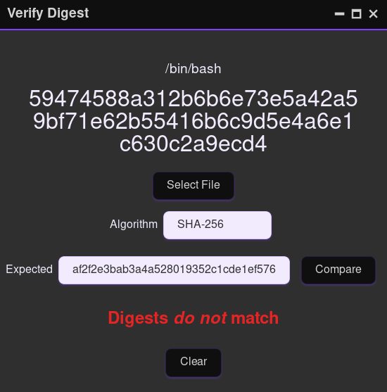

# Verify Digest (ckdigest)

A multi-platform desktop app that you can use to generate a digest (aka hash or checksum) for a file, and compare it to the expected value.

Copyright (c) 2024 Paul Sobolik

License: [MIT](./LICENSE)